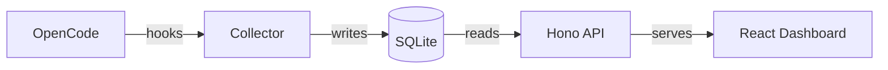

# opencode-meter

[](https://www.npmjs.com/package/opencode-meter)
[](https://github.com/gdfragoso/opencode-meter/actions)
[](LICENSE)
[](https://www.npmjs.com/package/opencode-meter)

Session metrics plugin for OpenCode. Tracks tokens, cost, tools, and agents into SQLite, with a Hono REST API and React dashboard.

## Features

- **Automatic collection** -- hooks into OpenCode's session, message, and tool lifecycle. No configuration needed.
- **Cost tracking** -- accumulated from OpenCode's `message.updated` events via the plugin API. No pricing configuration needed.
- **Dashboard** -- React SPA with charts, session details, tool timelines, model breakdowns, error tracking, and projects portfolio.
- **CLI** -- `opencode-meter --json`, `--summary`, `--serve`, `--prune` (no `bun run` needed after install).
- **Your prompts are not stored** -- the plugin records counts, timings and costs. Prompt text and file contents never reach the database; the one exception, a `task` call's arguments, is spelled out under [What Is Not Stored](#what-is-not-stored).
- **Decoupled server** -- dashboard runs independently of OpenCode. Stays alive when OpenCode closes.
- **Project portfolio** -- per-directory aggregated metrics with branch breakdown and model distribution.
- **Error tracking** -- captures session errors, error types, and error messages for debugging.

## Prerequisites

- **Bun >=1.1** -- required runtime for the plugin and CLI.
- **OpenCode >=1.4.3** -- the plugin hooks into OpenCode's plugin system.

## Quick Start

This package ships two installable components, the OpenCode plugin and the `opencode-meter` CLI. Install both.

1) Install the OpenCode plugin (metrics collector)

```jsonc
// ~/.config/opencode/opencode.jsonc
{
  "plugin": ["opencode-meter"]
}
```

OpenCode loads the plugin on next startup. The plugin initializes the database and collector hooks automatically. It does not start the HTTP server, and it does not install the `opencode-meter` command.

2) Install the `opencode-meter` CLI (dashboard plus commands)

```bash
npm install -g opencode-meter
```

The CLI reads from the SQLite database and provides `opencode-meter --serve` for the dashboard.

Troubleshooting: if you see `command not found: opencode-meter`, install the CLI with `npm install -g opencode-meter`.

## Alternative Install

Clone the repository and link it manually:

```bash
git clone https://github.com/gdfragoso/opencode-meter ~/.config/opencode/plugins/opencode-meter
cd ~/.config/opencode/plugins/opencode-meter
bun install
```

Now make the `opencode-meter` command available globally:

```bash
bun link --force
# or, if you prefer npm
npm install -g .
```

## Updating

Plugin (collector)

If installed via `opencode.jsonc`, change the version string in the plugin entry (or omit it to always use the latest).

CLI (dashboard plus commands)

Update from npm:

```bash
npm update -g opencode-meter
```

If you keep a git checkout and want the CLI updated from it:

```bash
cd ~/.config/opencode/plugins/opencode-meter
git pull
bun install
bun link --force
```

## Dashboard Usage

The dashboard is a separate HTTP server that runs independently of OpenCode. Start it in a terminal. This requires the CLI installed (Quick Start step 2):

```bash
opencode-meter --serve
```

Open http://127.0.0.1:9393 in your browser. To use another port, pass `--port N` or set `$OPENCODE_METER_PORT` (the Vite dev proxy reads the same variable).

The server stays alive when OpenCode closes. You can background it with `nohup`, `screen`, `tmux`, or `launchd`. The plugin itself only initializes the database and collector hooks, it does not start the HTTP server.

## CLI Usage

The CLI reads directly from the SQLite database and outputs to stdout:

```bash
opencode-meter --json      # Full metrics as JSON
opencode-meter --summary   # Per-model cost/tokens table
opencode-meter --serve     # Start dashboard HTTP server (default port 9393; override with --port N or $OPENCODE_METER_PORT)
opencode-meter --prune --days 90 --dry-run   # Show what would be deleted
opencode-meter --prune --days 90             # Delete old raw events, then VACUUM
opencode-meter             # Show help message
```

`--json` outputs total sessions, requests, cost, tokens, cache hit rate, tools, subagents, errors, per-model stats, and top agents. `--summary` renders a box-drawing table with model, sessions, cost, and tokens columns.

`--prune` deletes rows from the raw `events` log only. Session totals, file
activity and daily rollups are kept, so historical cost and token numbers stay
correct — what those sessions lose is the per-event tool timeline (the Gantt
chart and the per-tool breakdown in Session Detail). Run `--dry-run` first to
see the size. `VACUUM` needs an exclusive lock, so if OpenCode is running the
rows are deleted but the space is only returned to the filesystem on a later
prune with OpenCode closed; the command says which of the two happened.

## What This Plugin Tracks

| Metric | Description |
|--------|-------------|
| Tokens | Input, output, reasoning, cache read, cache write per session |
| Cost | Total cost per session with input/output/cache breakdown |
| Tools | Tool call counts, durations, and per-tool timing breakdowns |
| Agents | Main sessions and subagent sessions with parent/child relationships |
| File activity | Files read, created, modified, deleted per session |
| Steps and TTFT | Per-step token/cost breakdown and time-to-first-token |
| Compaction count | Number of context compaction events per session |
| Permissions | Permission requests and responses |
| Errors | Session error types and error messages |

## What Is Not Stored

The database holds counts, timings, costs and file paths. It does not hold
content:

| | |
|---|---|
| Your prompts | Never read. The collector counts messages; it does not keep their text. |
| File contents | OpenCode's `session.diff` event carries the whole file before and after each edit. Only the file path and the added/removed line counts are persisted. |
| Assistant replies | Never read. Only token counts and cost per message. |

The one exception is the `task` tool's arguments, stored on `tool.before` and
`tool.after` so delegations can be attributed to the subagent they spawned.
Those are the instructions written for a subagent, truncated to 500 characters
per field. If that matters to you, it is `sanitizeArgs` in
`src/collector/hooks.ts`.

## Architecture



The architecture is decoupled into two layers that share a SQLite database:

- **Collector** (`src/collector/`) -- hooks into OpenCode events via the plugin system. Accumulates session data in memory and persists it to SQLite on session end. Runs inside OpenCode's process.
- **Server** (`src/api/`) -- Hono REST API and React dashboard. Served by the CLI's `--serve` mode as a standalone HTTP server. Has no runtime dependency on the collector code; the two sides meet only at `src/data/` (schema, repositories, model types).

This means the dashboard can stay running even when OpenCode is closed, and the data keeps accumulating across OpenCode restarts.

## API Endpoints

| Method | Path | Description | Route file |
|--------|------|-------------|------------|
| GET | `/health` | Health check | `health.ts` |
| GET | `/api/sessions` | List sessions (`?days=&search=&status=&limit=&offset=&project=&branch=`) | `sessions.ts` |
| GET | `/api/sessions/types` | Main vs subagent breakdown (`?days=&project=&branch=`) | `sessions.ts` |
| GET | `/api/sessions/:id` | Session detail with subagents | `sessions.ts` |
| GET | `/api/sessions/:id/tree` | Delegation tree rooted at the session, with per-branch totals | `sessions.ts` |
| GET | `/api/sessions/:id/events` | Raw events for a session | `sessions.ts` |
| GET | `/api/sessions/:id/tools` | Tool usage breakdown for a session | `sessions.ts` |
| GET | `/api/sessions/:id/files` | File activity per session (read/created/modified/deleted) | `files.ts` |
| GET | `/api/cost-efficiency` | Cost per file changed / per edit / per line, split by agent and by tool (`?days=&project=&branch=`) | `cost.ts` |
| GET | `/api/period-comparison` | This window against the one before it, same length (`?days=&project=&branch=`) | `comparison.ts` |
| GET | `/api/models/cache-timeline` | Cache hit rate per model, day by day (`?days=&project=&branch=`) | `cache-timeline.ts` |
| GET | `/api/summary` | Aggregate: total sessions, tokens, cost, top models/agents (`?days=&project=&branch=`) | `summary.ts` |
| GET | `/api/daily` | Daily rollup rows (`?days=&project=&branch=`) | `daily.ts` |
| GET | `/api/events` | Events (`?session_id=`) | `events.ts` |
| GET | `/api/skills` | Aggregated skill usage (`?days=&project=&branch=`) | `skills.ts` |
| GET | `/api/tools/overview` | Aggregated tool call counts (`?days=&project=&branch=`) | `tools.ts` |
| GET | `/api/tools` | Tool metrics with estimated tokens/cost (`?days=&project=&branch=`) | `tool-metrics.ts` |
| GET | `/api/tool-metrics` | Same as `/api/tools` (alias) | `tool-metrics.ts` |
| GET | `/api/errors` | Error session aggregation (`?days=&project=&branch=`) | `errors.ts` |
| GET | `/api/models` | Per-model aggregate stats (`?days=&project=&branch=`) | `models.ts` |
| GET | `/api/projects` | Project portfolio (`?days=&project=&branch=`) | `projects.ts` |
| GET | `/api/projects/:directory` | Project detail with branch breakdown, model distribution | `projects.ts` |

Every route above except `/health`, `/api/events` and the per-session ones
(`/api/sessions/:id...`) accepts optional `?days=`, `?project=` and `?branch=`
to filter by window, project directory and branch. The `limit` parameter on
`/api/sessions` is clamped between 1 and 200, default 50.

## Data Storage

All data is stored in a single SQLite database at:

```
~/.local/share/opencode-meter/metrics.db
```

The database uses WAL mode for concurrent read/write access. Four tables:

| Table | Contents |
|-------|----------|
| `sessions` | Session metadata, tokens, cost, tools, errors, parent/child relationships, file activity, steps, tool timings |
| `events` | Raw event log (tool calls, step starts, permissions, commands, LSP diagnostics) |
| `daily_rollups` | Pre-computed daily aggregates (sessions, tokens, cost, tools, models, agents) |
| `session_files` | Per-file activity log (path, action, tool, additions, deletions) |

## Development

```bash
bun run dev        # Vite dev server (dashboard only)
bun run build      # tsc + vite build
bun test           # Run test suite
bun run typecheck  # tsc --noEmit
```

## Troubleshooting

**Port conflict.** The default port is 9393. `--serve` checks the port before binding: if another `opencode-meter` dashboard already answers there, it says so and exits rather than throwing `EADDRINUSE`.

```
[opencode-meter] A dashboard is already serving on port 9393: http://127.0.0.1:9393
Use --port to run a second one, or stop the other process.
```

Either use that dashboard, run a second one with `--serve --port N` (or `$OPENCODE_METER_PORT`, which the Vite dev proxy also reads, so dev and served builds agree), or stop the first:

```bash
lsof -nP -iTCP:9393 -sTCP:LISTEN          # see what holds it
kill $(lsof -t -iTCP:9393 -sTCP:LISTEN)
```

Use a plain `kill`, not `kill -9`: the server checkpoints the WAL and closes the
database on `SIGTERM`, and `SIGKILL` cannot be caught.

If something that is *not* a dashboard holds the port, the check does not
recognise it and the bind fails with `EADDRINUSE`.

**Additions and deletions look too high on old sessions.** Until this was fixed, the collector summed every `session.diff` event. OpenCode re-sends the session's cumulative snapshot diff on each edit, so a file already counted was counted again on every subsequent edit. Sessions recorded before the fix keep their inflated `additions`/`deletions`; there is no automatic repair. Sessions recorded after it are correct, and the totals are now derived from the stored events, so a session that ends more than once no longer accumulates.

**Tool tokens and cost read zero.** The `~Tokens` and `~Cost` columns under Top
Tools are split out of each step's cost, which the collector reads from
OpenCode's `step-finish` part. Until v1.1.1 the stored event omitted those two
figures, so every tool scored zero. Sessions recorded before the fix keep their
zeros — there is nothing to recompute them from — and sessions recorded after it
are populated.

**Empty dashboard.** If the dashboard loads but shows no data, make sure OpenCode has run at least one session with the plugin loaded. The collector only writes data when OpenCode emits session events. Check that the plugin appears in OpenCode's plugin list.

**Database corruption.** The database is at `~/.local/share/opencode-meter/metrics.db`. If it becomes corrupted, stop OpenCode and the dashboard, delete the file, and restart. The schema is recreated on next startup. Data loss is limited to the last session that was not persisted.

## Uninstall

1. Remove `"opencode-meter"` from the `plugin` array in `~/.config/opencode/opencode.jsonc`.
2. Optionally delete the data directory:
   ```bash
   rm -rf ~/.local/share/opencode-meter
   ```
3. If installed via git clone, remove the plugin directory:
   ```bash
   rm -rf ~/.config/opencode/plugins/opencode-meter
   ```

## Links

- [OpenCode](https://github.com/opencode-ai/opencode)
- [Hono](https://hono.dev)
- [React](https://react.dev)
- [Chart.js](https://www.chartjs.org)
- [Bun](https://bun.sh)

## License

MIT
